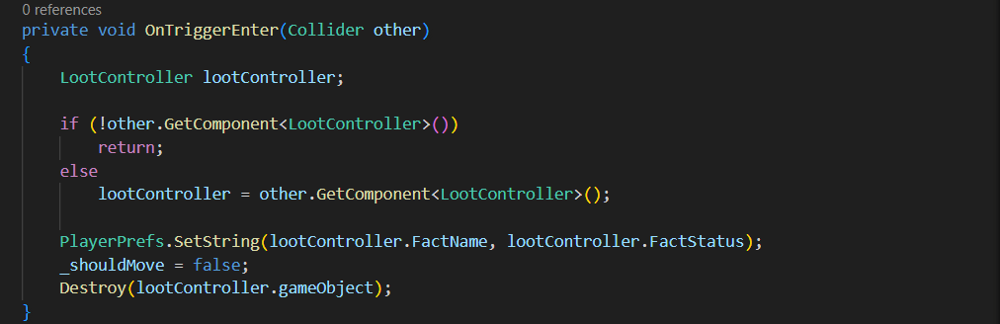
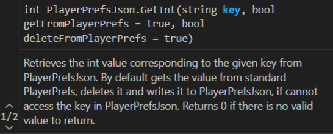
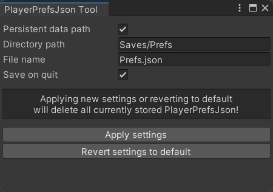
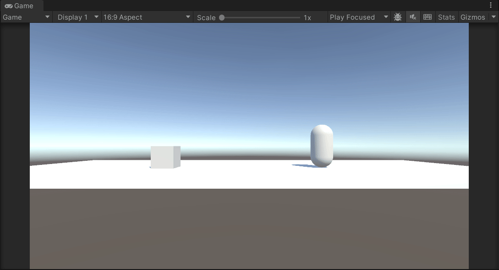

# **PlayerPrefsJson**

> [!NOTE]
> This repo contains the source code of my free PlayerPrefsJson asset available in the Unity Asset Store.

PlayerPrefsJson is a lightweight alternative for the Unity's built-in PlayerPrefs class. Instead of using system's registry, it allows to save data in the convenient JSON format, making it easier to read, write or share files, locally or in the cloud.

The asset requires minimal setup and can be added on top of an already existing project. It can be used to easily substitute standard PlayerPrefs in a safe manner or it can work alongside them as well.

PlayerPrefsJson uses the popular [Json.NET framework](https://www.newtonsoft.com/json) by Newtonsoft to ensure the industry's standard way of handling JSON files. It also includes an easy-to-use editor tool that helps to define custom settings for your specific project.

## **Features**

### **Identical methods**

PlayerPrefsJson provides exactly the same methods as standard PlayerPrefs, namely:

- DeleteAll()
- DeleteKey()
- GetFloat()
- GetInt()
- GetString()
- HasKey()
- Save()
- SetFloat()
- SetInt()
- SetString()

Each method behaves in a way that mirrors standard PlayerPrefs, but instead of the system's registry, data in stored in the JSON format. Since all methods have identical signatures to the ones provided by Unity, you can easily transition to PlayerPrefsJson in an existing project. Just swap the desired method call from PlayerPrefs to PlayerPrefsJson:

### **Performance**

PlayerPrefsJson carries out resource-consuming operations (creating, reading, writing to a file) only when absolutely necessary, i.e. when your application starts, quits (optionally) or when you call the Save() method. Otherwise, all data in stored in memory, ensuring as little impact on performance as possible.

### **Optional override of existing PlayerPrefs**

PlayerPrefsJson are built in a way that guarantees a seamless shift from standard PlayerPrefs in an existing project if the target data has been already stored in the system's registry. For example, by default the first call to the GetInt() method will try to fetch data from the standard PlayerPrefs, delete it and write it to JSON, providing a clean transistion to PlayerPrefsJson. If for some reason you want to keep your data in the system's registry, you can disable this behaviour using optional arguments:

### **Custom settings**

PlayerPrefsJson comes with default settings for the path where the JSON file will be stored. However, you can define your own directory and file name. You can also indicate whether PlayerPrefsJson should or not use a persistent data directory when saving the JSON file. Moreover, you can turn on/off the option to always save the data to a JSON file when the user quits your application (see [Unity's documentation](https://docs.unity3d.com/ScriptReference/Application-quitting.html) for more details).

### **Editor tool**

PlayerPrefsJson ships with a built-in editor tool which makes it easy to apply your own custom settings (or revert them):

## **Demo**

PlayerPrefsJson contains a simple demo scene and sample scripts that demonstrate the usage of the asset. When launching the scene for the first time, the player (capsule) will go to grab the loot (cube) and this fact will be saved to a JSON file. Upon a second (every other subsequent) launch of the scene, the content of the file will be read and the loot will not be present, since it has already been collected:

## **Credits**

Created by Wojciech Grodzicki.

- Thanks to Newtonsoft for the [Json.NET framework](https://www.newtonsoft.com/json).
